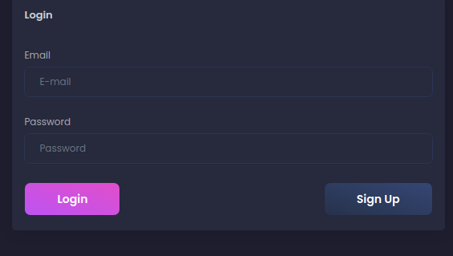
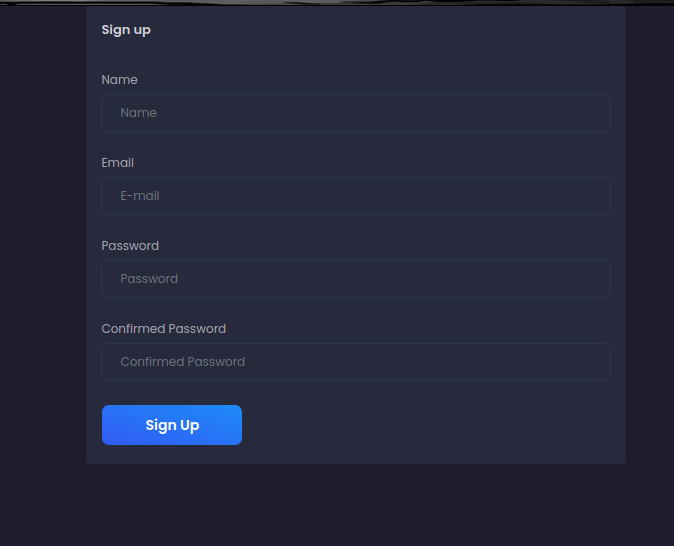
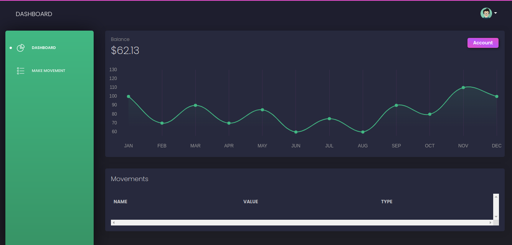
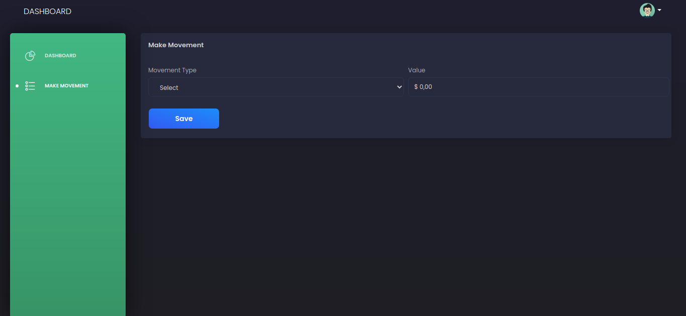

# Bank Account Tutorial

> ## Login
In this view, you can access the system with your user, and if you don't have one, you can click in Sign Up and make one user for you.

> ## Sign Up
In this view, you can create your on user, providing all data and clicking in Sign Up.

> ## Dashboard
In this view, you can all your actual balance, and your lasts movements, in and out of your account

> ## Make Movement
In this view, you can do some movements in your account, you have to select what type of movement you want and the value, and then save
